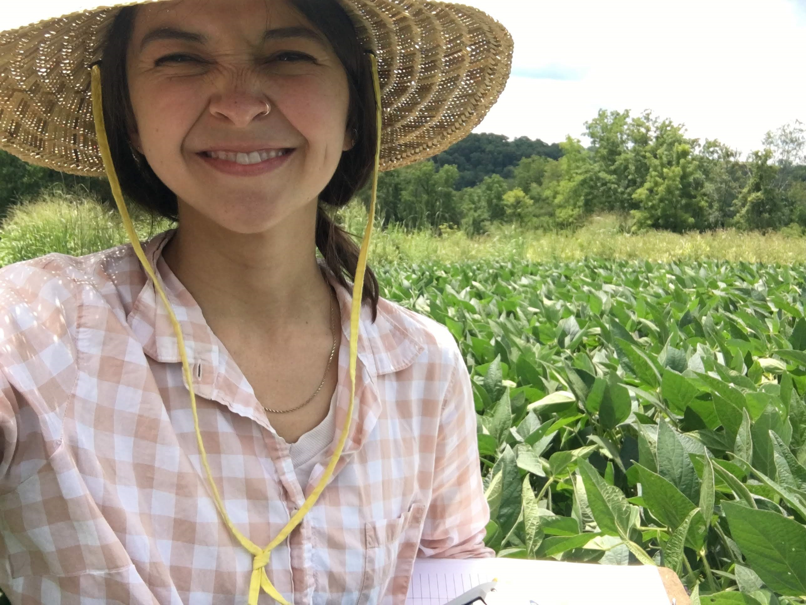

+++
widget = "blank"
headless = true
active = true
weight = 30

title = ""

[design]
columns = "1"

[design.background]
text_color_light = false

[advanced]
css_style = ""

css_class = ""

+++

I grew up in Rhode Island but consider myself more of a Midwesterner since I've lived in various parts of the north-central US for the last decade.  

My academic interests have evolved from conservation to sustainable agriculture. I studied biology for my [undergraduate degree](https://www.carleton.edu/). I took 4 years in between undergraduate and graduate school where I worked in research, on farms, and at bakeries. I returned to school to more formally study the ways in which we can combine agriculture and ecology. 

More recently I've developed an interest in data science, curation, and visualization but have had little formal training in programming/computer science basics. While I initially learned R while working at the Chicago Botanic Garden, I took it back up again in haste during my Master's Degree at Iowa State University. I've spent many hours willfully ignoring thesis writing in favor of trying out and attempting to "master" (ha!) new things. What I love about R is that it feels like solving a puzzle, it keeps me on my toes, everything is open-source, and the community/online resources are awesome. 

{}Download my CV{}

*Photos on this page: [The Salton Sea](https://en.wikipedia.org/wiki/Salton_Sea), February 2020. Simultaneously beautiful, fascinating, and gross.*