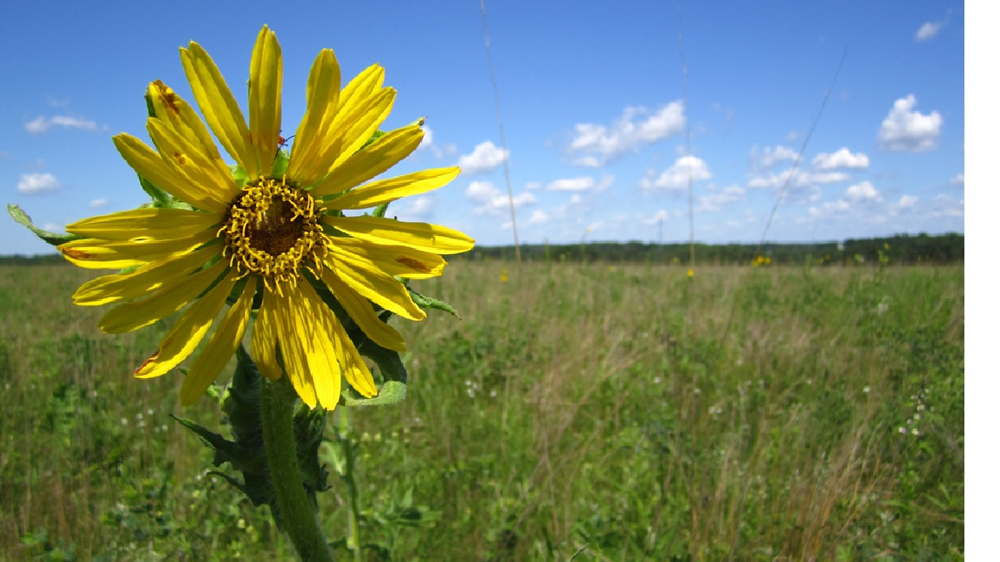

Here are a few of my favorite things:

- The majority of the recipes from this [cooking blog](http://smittenkitchen.com), plus the witty banter. I often refer to her on a first name basis. For instance:
  
  Someone else: "Hey where did you get this sick salad recipe from?"
  
  Me: "Deb, who else?!"

(We've never met)

- Even though I haven't finish the full trilogy I'm willing to put [this fantasy series](http://nkjemisin.com/series/the-broken-earth/) on my favorite list because it's that good. 

- [Compass plant](https://www.illinoiswildflowers.info/prairie/plantx/compassx.htm) - one of my favorite prairie plant species and very easy to identify for the novice. In addition to flowers and a stature that wows you, it's got some huge leaves that feel like sandpaper.   

